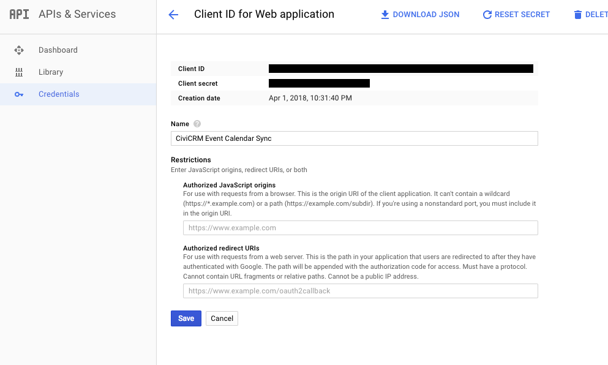

# CiviCRM Event sync with Google Calendar  #

### Overview ###

CiviCRM Event can be integrated with Google Calendar.

### Prerequisites ###
1. Have your Admin SDK and Google Calendar api enabled in https://console.developers.google.com

2. Create Google app and have your client ID and client secret

3. If your CiviCRM is already connected to Google app, you have to delete the access token in setting table in order to connect to new Google App.

### Installation ###

* Install the extension manually in CiviCRM. More details [here](http://wiki.civicrm.org/confluence/display/CRMDOC/Extensions#Extensions-Installinganewextension) about installing extensions in CiviCRM.
* Configure Google Auth details in Administer >> System Settings >> Googlecal Settings(civicrm/googlecal/settings?reset=1)

